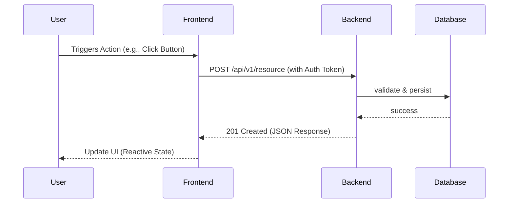

# Data Flow

## 🌊 Core Request Flow

This section describes how a user request traverses the system.

## 🛠️ Async Processing Flow

For long-running tasks:

1. **Frontend**: Submits request to API.
2. **Backend**: Enrolls task in Queue and returns `202 Accepted`.
3. **Worker**: Picks up task from Queue and executes.
4. **Data Store**: Worker updates status in database.
5. **Frontend**: Polls or receives notification (WebSocket) of completion.

## 💾 Storage Layer

- **Relational**: PostgreSQL for structured data.
- **Cache**: Redis for session and temporary states.
- **Object Storage**: MinIO for files and binary blobs.

