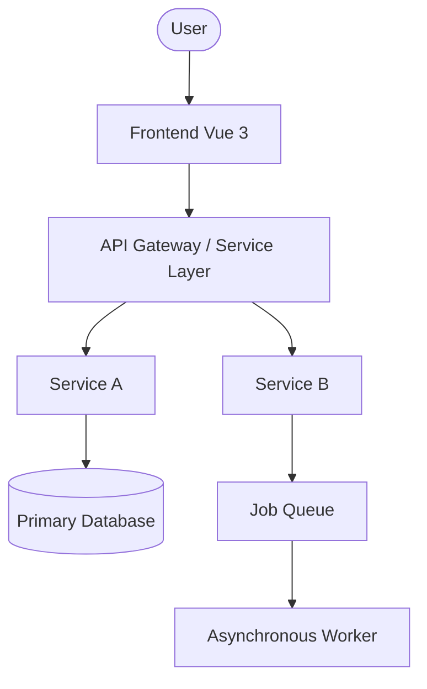

# System Architecture

## 🧭 High-Level Overview

The **PulseFrame** architecture follows a modular, N-Tier pattern. It is designed for maximum separation of concerns (SoC) and horizontal scalability.

## 🗺️ Architectural Diagram



## 📐 Design Patterns

- **Repository Pattern**: Decouples business logic from data access.
- **Observer Pattern**: Handles asynchronous event-driven updates.
- **Factory Pattern**: Manages the creation of complex service instances.

---

> [!IMPORTANT]
> Align structural changes with the project spec and agents guidance documents in the root docs folder.

# PulseFrame Architectural Rules and Philosophy

This document explains the core architectural principles and design decisions that guide the development of this project. Adhering to these rules ensures the codebase remains clean, maintainable, and scalable.

---

## 1. The Core Philosophy: A Clean, Layered Architecture

Our backend follows a philosophy inspired by Domain-Driven Design (DDD) to ensure a strict separation of concerns. Each layer has a distinct responsibility, and data flows in a predictable way.

### The Layers

1.  **`@RestController` (Controller Layer)**
    - **Responsibility**: The only layer that interacts with the outside world via HTTP. It handles incoming requests and outgoing responses.
    - **What it does**: It receives Data Transfer Objects (DTOs) from requests, validates them (`@Valid`), and passes the data to the Service layer. It then receives data back from the Service layer and maps it to DTOs before sending the final `ApiResponseWrapper`.
    - **Mapping Rule**: DTO ↔ Entity mapping happens **only** in Controllers or dedicated Mapper classes. Mapping logic must never leak into the Service layer.
    - **Key Rule**: Controllers **never** contain business logic. They are thin layers for translation and delegation.

2.  **`@Service` (Service Layer)**
    - **Responsibility**: This is where all business logic lives. It coordinates operations, performs calculations, and enforces business rules.
    - **What it does**: It operates **exclusively** on domain models (`@Entity` objects). It fetches entities from repositories, manipulates them according to the business requirements, and saves them back.
    - **Key Rule**: Services **never** know about DTOs or the HTTP layer. They are pure, reusable business logic components.
    - **Mapping Rule**: Services never perform DTO ↔ Entity mapping. They operate strictly on domain entities.

3.  **`@Repository` (Repository/Persistence Layer)**
    - **Responsibility**: To abstract all database interactions.
    - **What it does**: It provides methods to find, save, update, and delete entities from the database. It uses Spring Data JPA to handle the boilerplate.
    - **Key Rule**: Repositories are simple interfaces for data access. They do not contain business logic.

### Data Flow: DTOs vs. Entities

- **DTOs (Data Transfer Objects)**: These are plain Java objects used **only** to transfer data to and from the API (Controller layer). They define the public "shape" of our API.
- **Entities (`@Entity`)**: These are the rich domain models that represent our core business concepts (e.g., `User`, `Job`). They contain the actual state and are used within the Service and Repository layers.

**The flow is strict:**
`Request (DTO)` → `Controller` → `Service (operates on Entity)` → `Repository` → `Database`

---

## 2. API Design: Consistency and Clarity

A predictable API is a usable API. We follow strict RESTful principles.

- **Resource-Oriented URLs**: Use plural nouns for resources (e.g., `/api/v1/jobs`, `/api/v1/tracks`).
- **Standard HTTP Verbs**: `GET` (retrieve), `POST` (create), `PUT` (update), `DELETE` (remove).
- **Standardized Response Wrapper**: Every single API response is wrapped in `ApiResponseWrapper<T>`. This provides a consistent structure for the frontend to handle both successful data payloads and detailed error messages.

```json
// Success
{
  "status": "success",
  "data": { "...": "..." },
  "errors": []
}

// Failure
{
  "status": "fail",
  "data": null,
  "errors": [ { "field": "email", "message": "Email is already in use" } ]
}
```

---

## 3. Security First

SecurityConfig is the single source of truth for endpoint access control.

Security is implemented using defense in depth. Responsibilities are split between centralized configuration and method-level authorization. Security logic must never be scattered across controllers or implemented manually.

- **External vs. Internal IDs**: We never expose our database's auto-incrementing primary keys (`id`) in the API. Instead, every public-facing entity uses a `UUID` for external identification.
- **Robust Authentication**: We use a standard JWT flow with a short-lived access token and a long-lived refresh token stored in a secure, `HttpOnly` cookie.
- **Admin-Only Routes**: All administrative functions are protected under the `/api/v1/admin/` path and require `ADMIN` role privileges.

### 3.1 Centralized Endpoint Security (Primary Rule)

All authentication and route-level authorization must be defined in `SecurityConfig` using `SecurityFilterChain`.

This includes:

- Public vs protected endpoints
- Role-based access by URL
- JWT authentication filters
- Session policy, CORS, CSRF

**Example:**

```java
.authorizeHttpRequests(auth -> auth
    .requestMatchers("/api/v1/auth/**").permitAll()
    .requestMatchers("/api/v1/admin/**").hasAnyRole("ADMIN", "SUPERADMIN")
    .requestMatchers("/api/v1/**").authenticated()
)
```

**Rule:**
If access can be determined by endpoint or role pattern, it belongs in `SecurityConfig`, not in controllers.

**Why:**

- Central visibility of security rules
- Easier auditing
- Prevents duplication
- Cleaner controllers
- Industry standard enterprise practice

### 3.2 Method-Level Security (@PreAuthorize) — Use Sparingly

`@PreAuthorize` is enabled (`@EnableMethodSecurity`) but must only be used for data-level or business-level authorization, not basic role checks already enforced by `SecurityConfig`.

Use `@PreAuthorize` only when access depends on:

- **Ownership checks**
  ```java
  @PreAuthorize("#userId == authentication.principal.id")
  ```
- **Context-based permissions**
  ```java
  @PreAuthorize("@permissionService.canAccessJob(authentication, #jobId)")
  ```
- **Exceptional admin-only operations that are not route-based**
  ```java
  @PreAuthorize("hasRole('ADMIN')")
  ```
  _Admin checks should only use `@PreAuthorize` when the endpoint is not under an admin URL pattern already protected in SecurityConfig._

### 3.3 What NOT to Do

**❌ Do NOT duplicate SecurityConfig rules**

_Bad:_

```java
@PreAuthorize("hasRole('ADMIN')")
@GetMapping("/api/v1/admin/users")
```

_If the route is under `/api/v1/admin/**`, the role rule must be defined only in SecurityConfig._

**❌ Do NOT add @PreAuthorize to every controller method**

Scattering authorization:

- Makes security hard to audit
- Increases maintenance cost
- Leads to inconsistent behavior

**❌ Do NOT perform manual authorization in controllers or services**

_Bad:_

```java
if (!currentUser.getId().equals(userId)) {
    throw new AccessDeniedException("Forbidden");
}
```

Authorization logic must be handled via:

- `SecurityConfig`
- `@PreAuthorize`
- A dedicated `PermissionService`

### 3.4 Controllers Must Remain Clean

Controllers:

- Do not contain security logic
- Do not check roles manually
- Do not inspect the authentication object directly

**Controllers should assume:**
If execution reached this method, the request is already authorized.

**Controllers must not access Authentication directly.**
If user information (e.g., current user email or ID) is required, it must be provided via `@AuthenticationPrincipal` in the method signature. Never retrieve the SecurityContext manually inside the controller body.

_Good:_

```java
@PutMapping("/me")
public ResponseEntity<?> update(@AuthenticationPrincipal UserDetails userDetails) { ... }
```

_Bad:_

```java
Authentication auth = SecurityContextHolder.getContext().getAuthentication();
```

### 3.5 Security Responsibility Summary

| Concern                           | Location                              |
| :-------------------------------- | :------------------------------------ |
| **Authentication (JWT) Filter**   | Filter                                |
| **Public vs protected endpoints** | `SecurityConfig`                      |
| **Role access by URL pattern**    | `SecurityConfig`                      |
| **Ownership / resource access**   | `@PreAuthorize`                       |
| **Complex permissions**           | `PermissionService` + `@PreAuthorize` |
| **Manual checks in controllers**  | **Forbidden**                         |

---

## 4. Infrastructure and Deployment

- **Docker is King**: The entire application (backend and frontend) is containerized with Docker. This ensures a consistent environment from development to production.
- **Configuration via Environment**: We use Spring Profiles (`dev`, `prod`) to manage different configurations. All sensitive information (database credentials, JWT secrets) is injected via environment variables, never hardcoded.

---

## Golden Rules: The TL;DR

If you remember nothing else, remember these:

1.  **Controllers handle HTTP and DTOs.**
2.  **Services handle business logic and Entities.**
3.  **Repositories handle database access.**
4.  **Never mix these responsibilities.**
5.  **Use UUIDs for all external APIs.**
6.  **Wrap all API responses.**
7.  **All endpoint security lives in SecurityConfig.**
8.  **Use `@PreAuthorize` only for ownership or complex permissions.**
9.  **Never scatter role checks across controllers.**
10. **Use `@AuthenticationPrincipal` to get user info in controllers.**
11. **DTO ↔ Entity mapping happens ONLY in Controllers or Mappers.**
