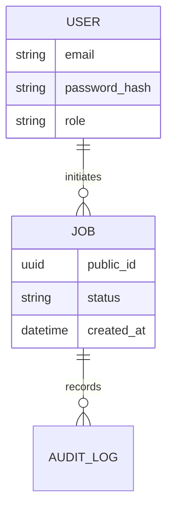

# Database Design

## 🗄️ Schema Overview

The database is structured to support high-integrity relational data with Flyway-based versioning.

## 🗺️ Entity Relationship Diagram

## 📜 Key Tables

- **`users`**: Stores credentials and role-based permissions.
- **`jobs`**: Main audit trail for asynchronous tasks.
- **`settings`**: Key-value pairs for global application configuration.

---

> [!CAUTION]
> Never store sensitive information like raw passwords; always use BCrypt or similar hashing algorithms.

